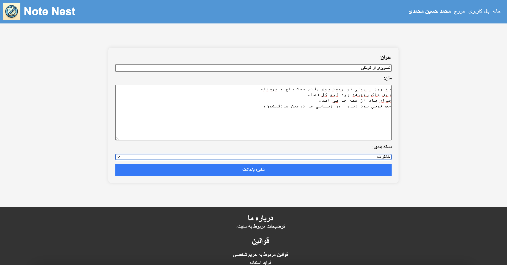
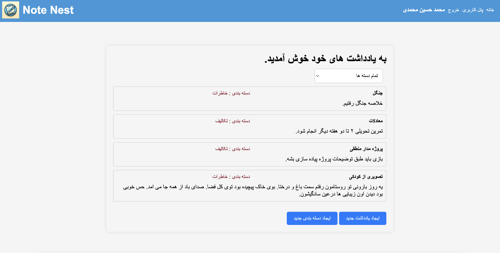
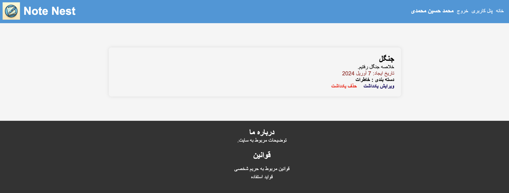
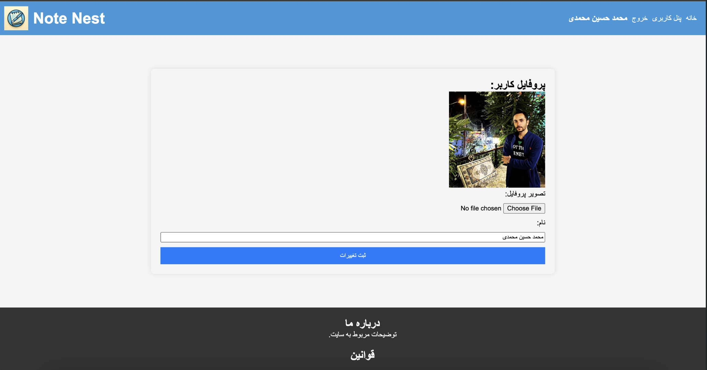
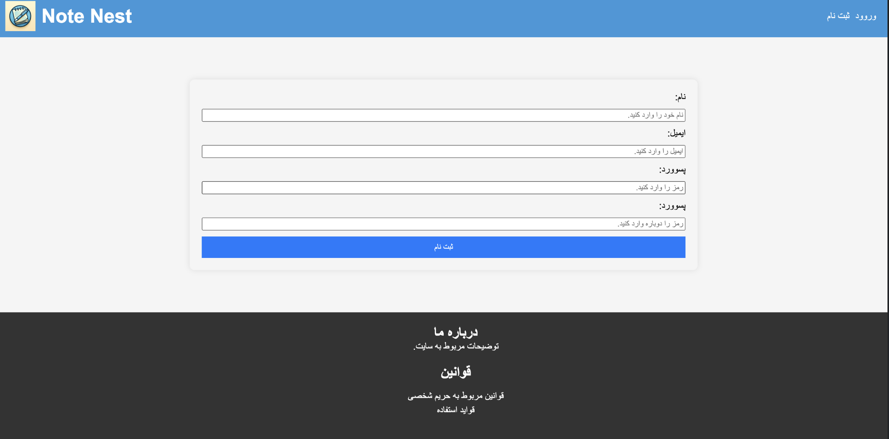
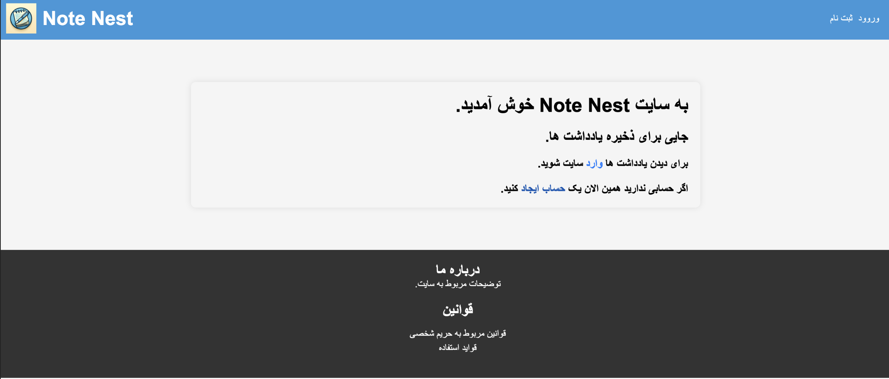

# Django Note Nest

## Description
Django Note Nest is a web application designed for storing and managing notes with user registration and login functionalities. Users can create, edit, and delete notes, categorize them, and view notes by category.

# Features
User Registration and Login: Users can create accounts and securely log in to access their notes.

Note Management: Create, edit, and delete notes as needed.

Category Organization: Notes can be categorized for better organization, and users can view notes by category.

# 🚀 Getting Started

# Installation

1. Clone the repository:
   
    ```bash
    git clone https://github.com/mohammadhm180/Django_Note_Nest.git
    ```
3. Navigate to the project directory:
    ```bash
    cd Django_Note_Nest
    ```
4. Install dependencies:
    ```bash
    pip install -r requirements.txt
    ```
5. Apply migrations:
    ```bash
    python manage.py migrate
    ```
6. Set up your email address for sending email while verifying users:
   
   first navigate to note_nest directory
   
    ```bash
    cd Django_Note_Nest/note_nest/
    ```
    now you need to add your email address and password in setting.py file in section below:
   
        EMAIL_HOST_USER = 'yourEmail@gmail.com'
        EMAIL_HOST_PASSWORD = 'EmailPassword'
# Usage
1. Start the development server:
   
    ```bash
    python manage.py runserver
    ```
2.Access the application in your web browser at http://127.0.0.1:8000/.

3.Register a new account or log in with existing credentials.

4.Start adding, editing, and deleting notes. Categorize your notes for better organization.

# Acknowledgments
Special thanks to the Django community for their excellent documentation and support.

## Screenshots








